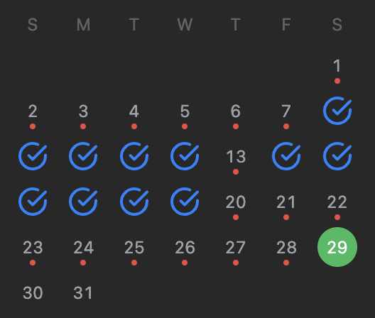
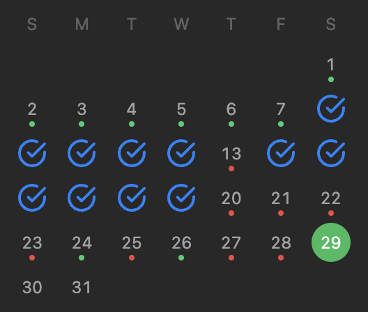

# LeetCode Daily Problem — Extension 🔥

LeetCode's daily-challenge calendar marks a day red the moment you miss it —
even if you go back and solve that problem later. This extension turns that
dot green once you've actually solved it, so your calendar reflects reality
instead of just punishing you forever for one bad day.

- 🔵 Blue checkmark — solved on time (LeetCode's own default, untouched)
- 🔴 Red dot — still unsolved
- 🟢 Green dot — solved late, but solved

## Before / After

<table>
  <tr>
    <th width="50%" align="center">Before</th>
    <th width="50%" align="center">After</th>
  </tr>
  <tr>
    <td width="50%" align="center"></td>
    <td width="50%" align="center"></td>
  </tr>
  <tr>
    <td width="50%" align="center">If you miss a daily problem, it stays red forever, even after you solve it later.</td>
    <td width="50%" align="center">Even if you missed a daily problem, once you solve it later it turns green — only still-unsolved daily problems stay red.</td>
  </tr>
</table>

## How to use it

1. Download/unzip this extension folder
2. Go to `chrome://extensions`
3. Turn on **Developer mode** (top-right toggle)
4. Click **Load unpacked** and select this folder
5. Open or refresh any leetcode.com page — the calendar widget (visible on
   the problem set page, your profile, etc.) will auto-update within a
   second or two

That's it — no login, no config, no options page. It reads your existing
LeetCode session in the browser, and nothing is sent anywhere except to
leetcode.com itself.
